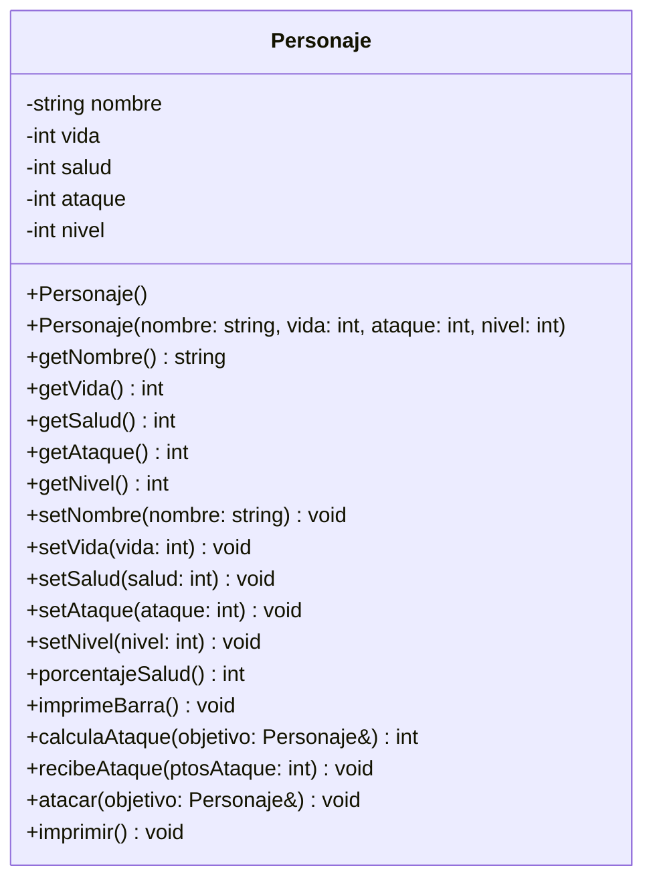

# Diagrama UML - Clase Personaje

## Descripción de los métodos

- **porcentajeSalud()**: calcula qué porcentaje de vida le queda al personaje, comparando `salud` (vida actual) contra `vida` (vida máxima). Devuelve un entero entre 0 y 100.
- **imprimeBarra()**: dibuja una barra de 20 caracteres. Cada carácter representa 5% de vida; usa `%` para la parte que aún tiene y `=` para la parte perdida.
- **calculaAtaque(objetivo)**: si el objetivo tiene un nivel mayor, el daño es aleatorio entre 1 y la mitad del ataque propio (penalización por pelear "hacia arriba"). Si el objetivo tiene nivel igual o menor, el daño es aleatorio entre la mitad y el total del ataque propio.
- **recibeAtaque(ptosAtaque)**: resta los puntos de daño a la salud actual; nunca deja la salud en negativo (mínimo 0).
- **atacar(objetivo)**: calcula el daño con `calculaAtaque` y se lo aplica al objetivo llamando a su `recibeAtaque`.
- **imprimir()**: muestra en pantalla nombre, nivel, ataque, salud actual/máxima y la barra de vida.
