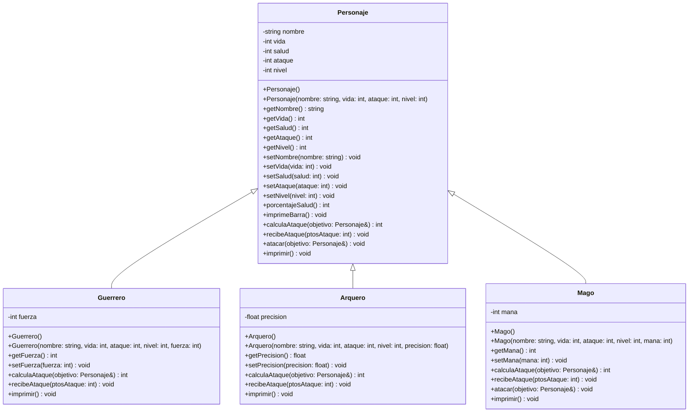

# Diagrama UML - Simulador de Batallas

## Descripción de los métodos de `Personaje` (clase base)

- **porcentajeSalud()**: calcula qué porcentaje de vida le queda al personaje, comparando `salud` (vida actual) contra `vida` (vida máxima). Devuelve un entero entre 0 y 100.
- **imprimeBarra()**: dibuja una barra de 20 caracteres. Cada carácter representa 5% de vida; usa `%` para la parte que aún tiene y `=` para la parte perdida.
- **calculaAtaque(objetivo)**: si el objetivo tiene un nivel mayor, el daño es aleatorio entre 1 y la mitad del ataque propio (penalización por pelear "hacia arriba"). Si el objetivo tiene nivel igual o menor, el daño es aleatorio entre la mitad y el total del ataque propio.
- **recibeAtaque(ptosAtaque)**: resta los puntos de daño a la salud actual; nunca deja la salud en negativo (mínimo 0).
- **atacar(objetivo)**: calcula el daño con `calculaAtaque` y se lo aplica al objetivo llamando a su `recibeAtaque`. Es `virtual`, así que las clases derivadas pueden decidir un flujo distinto (por ejemplo, `Mago` lo usa para recuperar maná tras un ataque letal).
- **imprimir()**: muestra en pantalla nombre, nivel, ataque, salud actual/máxima y la barra de vida. Es `virtual` para que cada clase derivada agregue su propia información.

## Descripción de los métodos de `Guerrero`

El Guerrero es una unidad cuerpo a cuerpo cuya `fuerza` funciona como potenciador de ataque y como armadura.

- **calculaAtaque(objetivo)**: reutiliza `Personaje::calculaAtaque` para el daño base y le suma un bono fijo de `fuerza / 5`.
- **recibeAtaque(ptosAtaque)**: la `fuerza` reduce el daño recibido en un porcentaje (`fuerza / 4`, con un tope máximo de 60% de reducción, para que nunca se vuelva invulnerable).
- **imprimir()**: llama a `Personaje::imprimir()` y agrega la línea con la clase y el valor de `fuerza`.

## Descripción de los métodos de `Arquero`

El Arquero es una unidad a distancia cuya `precision` (0.0 a 100.0, en %) determina probabilidad de golpes críticos y de esquivar ataques.

- **calculaAtaque(objetivo)**: reutiliza `Personaje::calculaAtaque` para el daño base. Con probabilidad igual a `precision`%, el golpe es crítico y el daño se multiplica por 1.5.
- **recibeAtaque(ptosAtaque)**: con probabilidad igual a `precision / 2`%, el arquero esquiva parcialmente el ataque y solo recibe la mitad del daño; si no esquiva, recibe el daño completo.
- **imprimir()**: llama a `Personaje::imprimir()` y agrega la línea con la clase y el valor de `precision`.

## Descripción de los métodos de `Mago`

El Mago es una unidad mágica cuyo `mana` (0 a 100) puede potenciar su ataque y reducir el daño recibido, pero se va gastando con el uso.

- **calculaAtaque(objetivo)**: reutiliza `Personaje::calculaAtaque` para el daño base. Si tiene maná disponible, existe una probabilidad (`mana / 2`%) de lanzar un "hechizo fuerte" que duplica el daño y consume 20 puntos de maná (nunca queda negativo).
- **recibeAtaque(ptosAtaque)**: reduce el daño recibido de forma escalonada según nivel y maná disponible: nivel ≥4 con maná >80 reduce el daño a un tercio; nivel ≥3 con maná >85 lo reduce a la mitad; nivel ≤2 con maná al 100% lo reduce a 3/4 partes. Fuera de esos umbrales, recibe el daño completo.
- **atacar(objetivo)**: reutiliza el flujo de `Personaje::atacar()` y, si el objetivo queda con 0 de salud tras el ataque, el mago "absorbe energía" y recupera 15 puntos de maná (tope 100).
- **imprimir()**: llama a `Personaje::imprimir()` y agrega la línea con la clase y el valor de `mana`.
