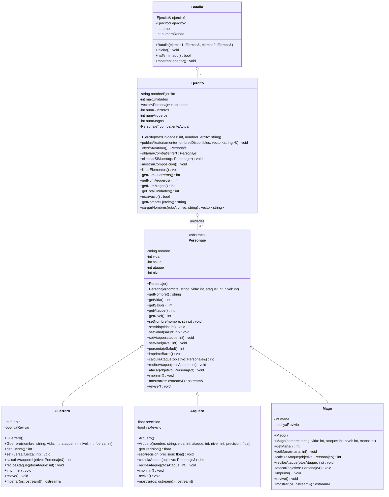

# Diagrama UML - Simulador de Batallas



> `Personaje` es una clase **abstracta**: `revive()` es virtual puro (marcado con `*` en el diagrama), por lo que no puede instanciarse directamente, solo a través de `Guerrero`, `Arquero` o `Mago`.
>
> `cargarNombres()` está marcado con `$` porque es un método **estático**: no depende de una instancia particular de `Ejercito`, se usa para cargar la lista de nombres una sola vez antes de poblar los ejércitos.

## Descripción de los métodos de `Personaje` (clase base)

- **Constructor con parámetros**: además de inicializar los atributos, valida que sean consistentes con la lógica del simulador y **lanza `std::invalid_argument`** si `vida <= 0`, `ataque < 0` o `nivel < 1` (ver sección "Manejo de excepciones" más abajo).
- **porcentajeSalud()**: calcula qué porcentaje de vida le queda al personaje, comparando `salud` (vida actual) contra `vida` (vida máxima). Devuelve un entero entre 0 y 100.
- **imprimeBarra()**: dibuja una barra de 20 caracteres. Cada carácter representa 5% de vida; usa `%` para la parte que aún tiene y `=` para la parte perdida.
- **calculaAtaque(objetivo)**: si el objetivo tiene un nivel mayor, el daño es aleatorio entre 1 y la mitad del ataque propio (penalización por pelear "hacia arriba"). Si el objetivo tiene nivel igual o menor, el daño es aleatorio entre la mitad y el total del ataque propio.
- **recibeAtaque(ptosAtaque)**: resta los puntos de daño a la salud actual; nunca deja la salud en negativo (mínimo 0). Cada clase derivada la sobreescribe para modificar el daño según su atributo especial, y al final llama a `revive()` para evaluar si el personaje se levanta o queda definitivamente muerto.
- **atacar(objetivo)**: calcula el daño con `calculaAtaque` y se lo aplica al objetivo llamando a su `recibeAtaque`. Es `virtual`, así que las clases derivadas pueden decidir un flujo distinto (por ejemplo, `Mago` lo usa para recuperar maná tras un ataque letal).
- **imprimir()**: muestra en pantalla nombre, nivel, ataque, salud actual/máxima y la barra de vida. Es `virtual` para que cada clase derivada agregue su propia información.
- **revive()**: método **virtual puro**. Decide, según la salud actual y el atributo especial de cada subclase, si el personaje se levanta con algo de vida o queda muerto definitivamente. Al no tener implementación en `Personaje`, obliga a cada clase derivada a definir su propia regla y hace que `Personaje` sea abstracta.
- **mostrar(os)**: escribe una representación breve del personaje (nombre, nivel, salud, ataque) en el stream recibido. Es el método que usa polimórficamente la sobrecarga del operador `<<` para imprimir cualquier `Personaje*` sin importar su subclase real.

## Sobrecarga de operador

Se sobrecargó el operador de flujo de salida `<<` (`operator<<`) como función `friend` de `Personaje`. Permite escribir `cout << personaje` o `cout << *punteroAPersonaje` y que se despliegue correctamente la información según la subclase real del objeto, gracias a que internamente delega en el método virtual `mostrar()`. Es el operador más útil para el proyecto porque se usa constantemente al recorrer el vector de combatientes durante las batallas.

## Descripción de los métodos de `Guerrero`

El Guerrero es una unidad cuerpo a cuerpo cuya `fuerza` funciona como potenciador de ataque y como armadura.

- **Constructor con parámetros**: además de lo que valida `Personaje`, lanza `std::invalid_argument` si `fuerza` es negativa.

- **calculaAtaque(objetivo)**: reutiliza `Personaje::calculaAtaque` para el daño base y le suma un bono fijo de `fuerza / 5`.
- **recibeAtaque(ptosAtaque)**: la `fuerza` reduce el daño recibido en un porcentaje (`fuerza / 4`, con un tope máximo de 60% de reducción, para que nunca se vuelva invulnerable). Al final llama a `revive()`.
- **imprimir()**: llama a `Personaje::imprimir()` y agrega la línea con la clase y el valor de `fuerza`.
- **revive()**: si la salud llegó a 0, la `fuerza` es `>= 25` y no ha revivido antes, se levanta con 20% de la vida máxima a cambio de perder la mitad de su `fuerza` (mensaje: *"se levanta con furia de batalla"*). El flag `yaRevivio` asegura que esto solo pase una vez; en cualquier otro caso, el personaje queda muerto.
- **mostrar(os)**: reutiliza `Personaje::mostrar()` y agrega el valor de `fuerza`.

## Descripción de los métodos de `Arquero`

El Arquero es una unidad a distancia cuya `precision` (0.0 a 100.0, en %) determina probabilidad de golpes críticos y de esquivar ataques.

- **Constructor con parámetros**: además de lo que valida `Personaje`, lanza `std::invalid_argument` si `precision` está fuera del rango 0.0 a 100.0.

- **calculaAtaque(objetivo)**: reutiliza `Personaje::calculaAtaque` para el daño base. Con probabilidad igual a `precision`%, el golpe es crítico y el daño se multiplica por 1.5.
- **recibeAtaque(ptosAtaque)**: con probabilidad igual a `precision / 2`%, el arquero esquiva parcialmente el ataque y solo recibe la mitad del daño; si no esquiva, recibe el daño completo. Al final llama a `revive()`.
- **imprimir()**: llama a `Personaje::imprimir()` y agrega la línea con la clase y el valor de `precision`.
- **revive()**: si la salud llegó a 0, la `precision` es `>= 30` y no ha revivido antes, esquiva la muerte y se levanta con 20% de la vida máxima a cambio de perder la mitad de su `precision`. El flag `yaRevivio` limita esto a una sola vez; en cualquier otro caso, el personaje queda muerto.
- **mostrar(os)**: reutiliza `Personaje::mostrar()` y agrega el valor de `precision`.

## Descripción de los métodos de `Mago`

El Mago es una unidad mágica cuyo `mana` (0 a 100) puede potenciar su ataque y reducir el daño recibido, pero se va gastando con el uso.

- **Constructor con parámetros**: además de lo que valida `Personaje`, lanza `std::invalid_argument` si `mana` está fuera del rango 0 a 100.

- **calculaAtaque(objetivo)**: reutiliza `Personaje::calculaAtaque` para el daño base. Si tiene maná disponible, existe una probabilidad (`mana / 2`%) de lanzar un "hechizo fuerte" que duplica el daño y consume 20 puntos de maná (nunca queda negativo).
- **recibeAtaque(ptosAtaque)**: reduce el daño recibido de forma escalonada según nivel y maná disponible: nivel ≥4 con maná >80 reduce el daño a un tercio; nivel ≥3 con maná >85 lo reduce a la mitad; nivel ≤2 con maná al 100% lo reduce a 3/4 partes. Fuera de esos umbrales, recibe el daño completo. Al final llama a `revive()`.
- **atacar(objetivo)**: reutiliza el flujo de `Personaje::atacar()` y, si el objetivo queda con 0 de salud tras el ataque (es decir, murió de verdad y no revivió), el mago "absorbe energía" y recupera 15 puntos de maná (tope 100).
- **imprimir()**: llama a `Personaje::imprimir()` y agrega la línea con la clase y el valor de `mana`.
- **revive()**: si la salud llegó a 0, el `mana` es `> 50` y no ha revivido antes, usa su última reserva de energía mágica para levantarse con 20% de la vida máxima, a cambio de gastar 50 puntos de `mana`. El flag `yaRevivio` limita esto a una sola vez; en cualquier otro caso, el personaje queda muerto.
- **mostrar(os)**: reutiliza `Personaje::mostrar()` y agrega el valor de `mana`.

## Descripción de los métodos de `Ejercito`

`Ejercito` es dueño de un `vector<Personaje*>` (relación de **composición**: cuando el ejército se destruye, libera la memoria de todos sus integrantes). No se puede copiar (`Ejercito(const Ejercito&) = delete`), precisamente para evitar que dos ejércitos terminen apuntando a los mismos personajes y se intente liberar la misma memoria dos veces.

- **Constructor `Ejercito(maxUnidades, nombreEjercito)`**: guarda el límite de unidades y el nombre del ejército; el vector empieza vacío, se puebla después con `poblarAleatoriamente()`. Lanza `std::invalid_argument` si `maxUnidades <= 0`.
- **poblarAleatoriamente(nombresDisponibles)**: crea hasta `maxUnidades` personajes de tipo aleatorio (Guerrero/Arquero/Mago, con probabilidad igual entre los tres) y estadísticas aleatorias dentro de rangos razonables. Cada personaje toma un nombre al azar de `nombresDisponibles` y lo **elimina** de esa lista, para que dos ejércitos que comparten la misma lista de nombres nunca se repitan un nombre entre sí. Si la lista de nombres se agota antes de llegar a `maxUnidades`, el ejército se queda con menos unidades y se imprime un aviso.
- **elegirAleatorio()**: regresa un puntero a un elemento aleatorio del vector (o `nullptr` si el ejército está vacío).
- **obtenerCombatiente()**: regresa el combatiente que sigue peleando por este ejército. Si el combatiente anterior ya tiene 0 de salud (y su `revive()` no lo salvó), lo elimina del vector y elige uno nuevo al azar. Así, un mismo personaje sigue peleando ronda tras ronda hasta que muere de verdad.
- **eliminarSiMuerto(p)**: si `p` tiene 0 de salud, lo quita del vector, ajusta los contadores por tipo y libera su memoria (`delete`).
- **mostrarComposicion()**: imprime cuántos Guerreros, Arqueros y Magos tiene el ejército actualmente, y el total.
- **listarElementos()**: imprime, uno por uno (usando el `operator<<` sobrecargado), todos los elementos que siguen en el ejército.
- **cargarNombres(rutaArchivo)** *(método estático)*: lee un archivo de texto con un nombre por línea (como `names.txt`) y regresa un `vector<string>`. Se llama una sola vez antes de poblar los ejércitos, y el vector resultante se comparte entre ambos. Lanza `std::runtime_error` si el archivo no se pudo abrir.

## Descripción de los métodos de `Batalla`

`Batalla` **no es dueña** de los ejércitos: los recibe por referencia (`Ejercito&`), ya que ambos existen fuera de la batalla (por ejemplo, en `main`) y deben seguir vivos mientras dura el combate.

- **Constructor `Batalla(ejercito1, ejercito2)`**: guarda las referencias a ambos ejércitos, inicia el turno en el ejército 1 y el contador de rondas en 1. Lanza `std::invalid_argument` si alguno de los dos ejércitos ya está vacío (no hay batalla que correr sin al menos un elemento por bando).
- **iniciar()**: corre el ciclo principal de la batalla. Primero muestra en pantalla la composición inicial de ambos ejércitos. Luego, mientras dura el ciclo de combate, redirige `cout` hacia un archivo `simulacion_<timestamp>.txt` (ver sección siguiente), así que todo el detalle ronda por ronda queda documentado ahí en vez de saturar la pantalla. En cada ronda, el ejército en turno obtiene su combatiente (que puede ser uno nuevo si el anterior murió), lo mismo el ejército rival, y el atacante ejecuta `atacar()` sobre el defensor. El turno se alterna después de cada ronda. El ciclo continúa hasta que `haTerminado()` sea verdadero; al terminar, `cout` vuelve a la pantalla y se llama `mostrarGanador()`.
- **haTerminado()**: regresa `true` si cualquiera de los dos ejércitos se quedó sin elementos (`estaVacio()`).
- **mostrarGanador()**: al terminar la batalla, imprime cuál ejército ganó (el que no se quedó vacío), o un empate si ambos se vaciaron en la misma ronda.
- **getArchivoSalida()**: regresa el nombre del archivo donde quedó guardado el detalle de la última batalla corrida (por ejemplo, `simulacion_20260722_220248.txt`).

## Redirección de la salida ronda por ronda hacia un archivo

Para que la pantalla no se sature con decenas de rondas de combate, `Batalla::iniciar()` solo muestra en pantalla la **composición inicial** de ambos ejércitos y, al final, el **ejército ganador**. Todo el detalle intermedio (cada ataque, cada `imprimir()`, cada mensaje de golpe crítico/esquive/hechizo fuerte/revive) se guarda en un archivo de texto llamado `simulacion_<timestamp>.txt` (por ejemplo `simulacion_20260722_220248.txt`), donde el timestamp se genera con la hora local del sistema en el momento de iniciar la batalla.

**¿Cómo se logra sin modificar `Personaje`, `Guerrero`, `Arquero`, `Mago` ni `Ejercito`?** `std::cout` es un objeto que escribe hacia un "buffer" (`std::streambuf`) interno; normalmente ese buffer está conectado a la terminal. `cout.rdbuf(otroBuffer)` permite cambiar ese buffer en tiempo de ejecución, de modo que cualquier `cout <<` posterior —sin importar en qué función o clase esté— empieza a escribir hacia donde apunte el nuevo buffer. Como todos los métodos del proyecto ya usaban `cout <<` internamente, no hizo falta tocarlos: basta con redirigir el buffer antes del ciclo de combate y restaurarlo después.

Para hacer esa redirección seguros, se usa el patrón **RAII** (*Resource Acquisition Is Initialization*) con una clase auxiliar `RedireccionCout` (definida dentro de `Batalla.cpp`, en un namespace anónimo):

- Su **constructor** guarda el buffer original de `cout` y lo cambia hacia el archivo.
- Su **destructor** restaura el buffer original.

Como en C++ los destructores se ejecutan automáticamente al salir de un bloque `{ }` —incluso si algo lanza una excepción a la mitad de la batalla—, `cout` siempre termina apuntando de vuelta a la pantalla de forma garantizada, sin importar cómo se salga del bloque de combate.

## Manejo de excepciones

El simulador usa excepciones **predefinidas** de `<stdexcept>` para señalar condiciones que rompen la lógica del programa si se dejan pasar silenciosamente. La regla que se siguió: **cada clase valida y lanza la excepción justo donde ocurre el problema**, y **`exercise.cpp` (el `main`) es el único lugar que las captura**, con `try`/`catch`. Esto evita que un dato inválido (por ejemplo, un personaje con vida negativa) se propague por el programa y produzca resultados sin sentido más adelante, y mantiene la lógica de "qué hacer cuando algo falla" concentrada en un solo lugar.

| Dónde se lanza | Excepción | Condición |
|---|---|---|
| `Personaje(nombre, vida, ataque, nivel)` | `std::invalid_argument` | `vida <= 0`, `ataque < 0` o `nivel < 1` |
| `Guerrero(...)` | `std::invalid_argument` | `fuerza < 0` |
| `Arquero(...)` | `std::invalid_argument` | `precision` fuera de 0.0–100.0 |
| `Mago(...)` | `std::invalid_argument` | `mana` fuera de 0–100 |
| `Ejercito(maxUnidades, ...)` | `std::invalid_argument` | `maxUnidades <= 0` |
| `Ejercito::cargarNombres(...)` | `std::runtime_error` | no se pudo abrir el archivo de nombres |
| `Batalla(ejercito1, ejercito2)` | `std::invalid_argument` | algún ejército está vacío al construirla |

**¿Por qué `invalid_argument` en unos casos y `runtime_error` en otros?** Es la distinción semántica estándar de la biblioteca de C++: `std::invalid_argument` se usa cuando el problema es un **parámetro que el código recibió y no debió aceptar** (vida negativa, precisión fuera de rango, un ejército de tamaño 0), mientras que `std::runtime_error` se usa cuando el problema viene de **algo externo al programa** que pudo haber cambiado (el archivo `names.txt` no existe o no se pudo abrir).

**Encadenamiento entre constructores.** Cuando el constructor de una clase derivada (`Guerrero`, `Arquero`, `Mago`) llama al constructor de `Personaje` en su lista de inicialización, si `Personaje` lanza la excepción, **el resto del constructor derivado nunca se ejecuta** — ni siquiera se llega a asignar `fuerza`, `precision` o `mana`. Esto es un comportamiento estándar de C++ (no es específico de este proyecto), pero vale la pena tenerlo presente: no hace falta duplicar la validación de `vida`/`ataque`/`nivel` en las clases derivadas, porque si esos valores son inválidos, la excepción ya se lanzó antes de que el constructor derivado continúe.

**Manejo centralizado en `exercise.cpp`.** El `main` envuelve todo el flujo (carga de nombres, creación y población de ejércitos, creación de la batalla) en un solo bloque `try`, con tres `catch` en orden de más específico a más general:

```cpp
try { /* ... */ }
catch (const std::invalid_argument& e) { /* datos invalidos */ }
catch (const std::runtime_error& e)    { /* fallo externo, ej. archivo */ }
catch (const std::exception& e)        { /* cualquier otra excepcion estandar */ }
```

El orden importa: en C++, los bloques `catch` se evalúan de arriba hacia abajo y se ejecuta el primero que haga match. Como `std::invalid_argument` y `std::runtime_error` heredan de `std::exception`, si el `catch (const std::exception&)` se pusiera primero, atraparía absolutamente todo y los `catch` más específicos de abajo nunca se alcanzarían (de hecho, la mayoría de los compiladores marcan eso como error o advertencia de código inalcanzable). Cada mensaje de error se imprime con `cerr` (no `cout`, ya que es un canal separado pensado para errores) y el programa termina con código de salida `1` en vez de continuar con datos corruptos o tronar sin explicación.
